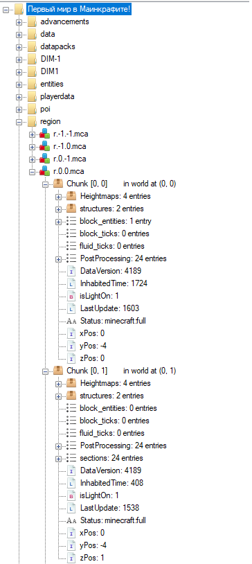

# Доигрался (misc) - 356 points
## Writeup Author: GameIsOn
---
## Task and files
`Нашёл у себя в закромах мир майнкрафта, которому, не знаю, 10 лет? Обновил до последней версии, зашёл, а стёрт единственный нужный мне чанк! Помогите найти кусочек информации, нужной мне...`

[world.zip](world.zip)

---

Действительно, в архиве лежит мир Майнкрафта. В задании говорится, что стёрт чанк, поэтому посмотрим через NBTExplorer, что от него осталось.

У чанка стёрт пункт sections, где хранится информация о расположениях блоков на данный момент. Поэтому, при запуске будет стёрта какая-то оставшиеся информация. Сравниваем чанки (0, 0) (стёртый) и (0, 1). Видим, что block_entities отличается: у стёртого чанка что-то сохранилось.

У чанка сохранилась информация о поставленной табличке.

---
## Flag

`ctfschool{m1n3cr4ft_l00ks_0dd_1n_th3s3_f1l3s}`